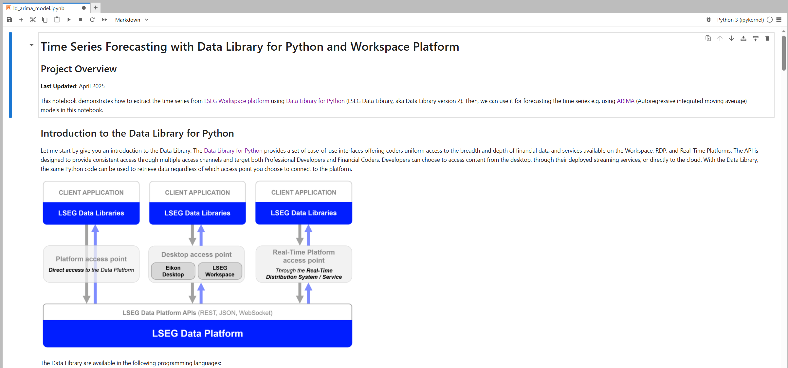

# Time Series Forecasting with Data Library for Python and Workspace Platform
- Last update: April 2025
- Environment: Windows 
- Compiler: Python 
- Prerequisite: LSEG Workspace desktop application with access to Data Library.

## <a id="overview"></a>Project Overview

**Last Updated**: April 2025

This project demonstrates how to extract the time series from [LSEG Workspace platform](https://www.lseg.com/en/data-analytics/products/workspace) using [Data Library for Python](https://developers.lseg.com/en/api-catalog/lseg-data-platform/lseg-data-library-for-python) (LSEG Data Library, aka Data Library version 2). Then, we can use it for forecasting the time series e.g. using [ARIMA](https://www.ibm.com/think/topics/arima-model) (Autoregressive integrated moving average) models in this notebook.

## Introduction to the Data Library for Python

Let me start by give you an introduction to the Data Library. The [Data Library for Python](https://developers.lseg.com/en/api-catalog/lseg-data-platform/lseg-data-library-for-python) provides a set of ease-of-use interfaces offering coders uniform access to the breadth and depth of financial data and services available on the Workspace, RDP, and Real-Time Platforms. The API is designed to provide consistent access through multiple access channels and target both Professional Developers and Financial Coders. Developers can choose to access content from the desktop, through their deployed streaming services, or directly to the cloud. With the Data Library, the same Python code can be used to retrieve data regardless of which access point you choose to connect to the platform.

 

The Data Library are available in the following programming languages:

- [Python](https://developers.lseg.com/en/api-catalog/lseg-data-platform/lseg-data-library-for-python)
- [.NET](https://developers.lseg.com/en/api-catalog/lseg-data-platform/lseg-data-library-for-net)
- [TypeScript](https://developers.lseg.com/en/api-catalog/refinitiv-data-platform/refinitiv-data-library-for-typescript)

For more deep detail regarding the Data Library for Python, please refer to the following articles and tutorials:

- [Quickstart](https://developers.lseg.com/en/api-catalog/lseg-data-platform/lseg-data-library-for-python/quick-start).
- [Documentation](https://developers.lseg.com/en/api-catalog/lseg-data-platform/lseg-data-library-for-python/documentation).
- [Tutorials](https://developers.lseg.com/en/api-catalog/lseg-data-platform/lseg-data-library-for-python/tutorials).
- [GitHub](https://github.com/LSEG-API-Samples/Example.DataLibrary.Python).

#### Disclaimer

This project is based on Data Library Python versions **2.1.1** using the Desktop Session only.

That covers an overview of the Data Library

### Introduction to ARIMA models

My next point is the ARIMA model. The [ARIMA models]([ARIMA](https://www.ibm.com/think/topics/arima-model)) are a class of statistical models for analyzing and forecasting time series data. ARIMA consists of the following key aspects of the model

- **AR**: Autoregression. A model that uses the dependent relationship between an observation and some number of lagged observations.
- **I**: Integrated. The use of differencing of raw observations (e.g. subtracting an observation from an observation at the previous time step) in order to make the time series stationary.
- **MA**: Moving Average. A model that uses the dependency between an observation and a residual error from a moving average model applied to lagged observations.

Each of these components are explicitly specified in the model as a parameter. A standard notation is used of ARIMA(p,d,q) where the parameters are substituted with integer values to quickly indicate the specific ARIMA model being used.

The parameters of the ARIMA model are defined as follows:

- *p*: The number of lag observations included in the model, also called the lag order.
- *d*: The number of times that the raw observations are difference, also called the degree of differencing.
- *q*: The size of the moving average window, also called the order of moving average.

A value of 0 can be used for a parameter, which indicates to not use that element of the model. This way, the ARIMA model can be configured to perform the function of an ARMA model, and even a simple AR, I, or MA model.

That’s all I have to say about the ARIMA models.

## <a id="prerequisite"></a>Prerequisite
This example requires the following dependencies softwares and libraries.

1. LSEG Workspace desktop application with access to Data Library for Python.
2. [Python](https://www.python.org/) ([Ananconda](https://www.anaconda.com/distribution/) or [MiniConda](https://docs.conda.io/en/latest/miniconda.html) distribution/package manager also compatible).
3. [Jupyter Lab](https://jupyter.org/) application.

*Note:* 
- This Project has been qualified with Python version 3.11.5
- If you are not familiar with Jupyter Lab application, the following [tutorial](https://www.datacamp.com/tutorial/tutorial-jupyter-notebook) created by DataCamp may help you.

## <a id="running"></a>How to run this example

Please note that the Workspace desktop application integrates a Data API proxy that acts as an interface between the Python library and the Workspace Platform. For this reason, the Workspace application must be running when you use the Data library.

The first step is unzip or download the example project folder into a directory of your choice, then choose how to run application based on your environment below.

### Running the Notebook example.

1. Open a Command Prompt and go to project's folder
2. Run the following command in a Command Prompt to create a Python virtual environment named *ld_forecast* for the project.

    ```bash
    $>python -m venv ld_forecast
    ```

3. Once the environment is created, activate a virtual environment named ```ld_forecast``` with this command in a Command Prompt

    ```bash
    $>ld_forecast\Scripts\activate
    ```

4. Go to project's notebook folder and update a contain in ```lseg-data.config.json``` file with the your App-Key

    ```json
    {
        "logs": {
            "level": "debug",
            "transports": {
                "console": {
                    "enabled": false
                },
                "file": {
                    "enabled": false,
                    "name": "lseg-data-lib.log"
                }
            }
        },
        "sessions": {
            "default": "desktop.workspace",
            "desktop": {
                "workspace": {
                    "app-key": "YOUR APP KEY GOES HERE!"
                }
            }
        }
    }
    ```

5. Run the following command in a Command Prompt to install the project dependencies

    ```bash
    $>(ld_forecast) pip install -r requirements.txt
    ```

6. In the current Command Prompt, go to project's notebook folder. Run the following command to start Jupyter Lab in the notebook folder.

    ```bash
    $>(ld_forecast)>notebook>jupyter lab
    ```

7. Open *ld_arima_model.ipynb* Notebook document, then follow through each notebook cell.

     

**Note**: If you are using AnaConda/MiniConda, please refer to this [Conda - Managing environments document](https://docs.conda.io/projects/conda/en/stable/user-guide/tasks/manage-environments.html) for more detail about how create and activate environment with Conda.

## <a id="summary"></a>Conclusion

At the end of this project, you should be able to get time series from LSEG Workspace platform using ```get_history``` function in Data Library for Python. Then, you can use the time series with ARIMA model to make forecasts or use the time series for other purposes.

<!-- ACKNOWLEDGEMENTS -->
## <a id="acknowledgements"></a>Acknowledgements

Special thank to [Pimchaya](https://github.com/Pimchaya), original creator of this project.

## <a id="references"></a>References

You can find more detail regarding the Data Library and related technologies for this Notebook from the following resources:

- [LSEG Data Library for Python](https://developers.lseg.com/en/api-catalog/lseg-data-platform/lseg-data-library-for-python) on the [LSEG Developer Community](https://developers.lseg.com/)
- [Data Library for Python - Reference Guide](https://developers.lseg.com/en/api-catalog/lseg-data-platform/lseg-data-library-for-python/documentation#reference-guide)
- [The Data Library for Python  - Quick Reference Guide (Access layer)](https://developers.lseg.com/en/article-catalog/article/the-data-library-for-python-quick-reference-guide-access-layer) article.
- [Essential Guide to the Data Libraries - Generations of Python library (EDAPI, RDP, RD, LD)](https://developers.lseg.com/en/article-catalog/article/essential-guide-to-the-data-libraries) article.
- [Upgrade from using Eikon Data API to the Data library](https://developers.lseg.com/en/article-catalog/article/Upgrade-from-using-Eikon-Data-API-to-the-Data-library) article.
- [Data Library for Python Examples on GitHub](https://github.com/LSEG-API-Samples/Example.DataLibrary.Python) repository.
- [statsmodels library](https://www.statsmodels.org/stable/index.html) page.
- [What are ARMIA models? - IBM document](https://www.ibm.com/think/topics/arima-model) page.
- [How to Create an ARIMA Model for Time Series Forecasting in Python](https://machinelearningmastery.com/arima-for-time-series-forecasting-with-python/) blogpost.

For any question related to this example or Data Library, please use the Developers Community [Q&A Forum](https://community.developers.refinitiv.com).
